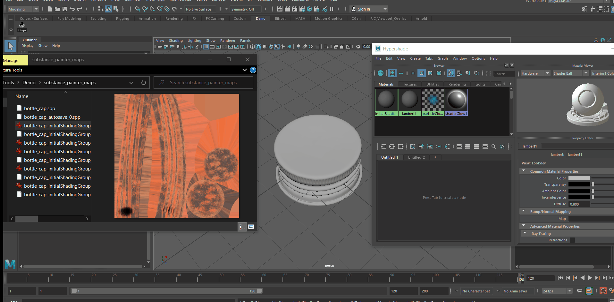
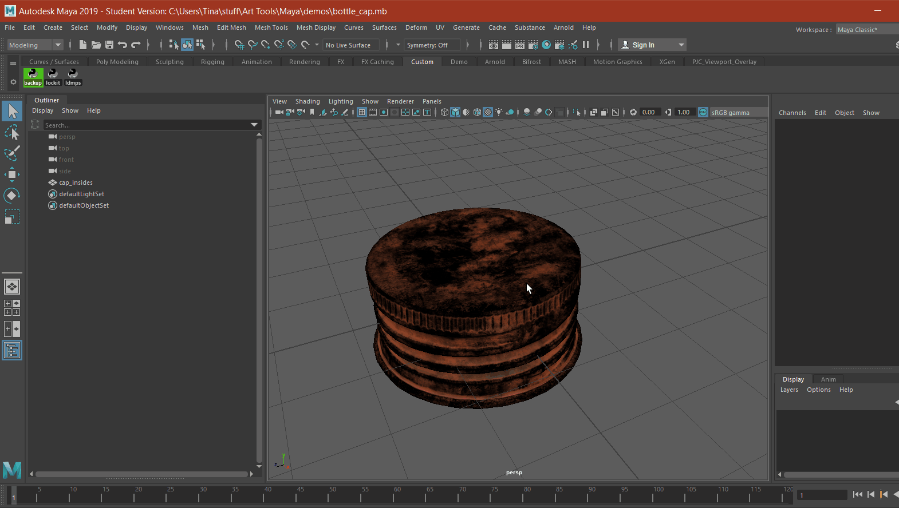

# Maya python tools
Python tools for Maya. Can be installed as custom tools via the script editor.

## General install instructions
1. `git clone` or download this repo to desired location
2. In Maya, open Windows > General Editors > Script Editor
3. In the script editor, select File > Open Script...
4. Browse for the script you wish to install and Open. The script should show up in the editor.
5. Select File > Save Script to Shelf..., and give the tool a name of your choice

## loadSubstanceMaps.py
Browse for a folder containing Substance Painter texture maps and import as an aiStandardSurface. 
* Creates the nodes for BaseColor, Normal, Metalness and Roughness maps. 
* Uses the appropriate color space (Raw or sRGB) for each map.

### Demo 

### Motivation
This is a commonly required feature, maps exported from Substance Painter can be tedious to apply to objects. This allows a folder of maps to be imported as aiStandardSurface with one click.

### Usage
1. Create custom shelf tool (see above install instructions)
2. Click on tool, click Browse to select the folder that contains the maps from Substance Painter
3. Click "Import as aiStandardSurface" to import
4. Open Hypershade to view the aiStandardSurface nodes and apply the aiStandardSurface to the model
5. Press "6" to display texture maps in the viewport for preview

### Major Limitations
 1. Does not currently handle the height map
 2. When browsing for the folder of maps, the maps contained in the folder cannot be viewed
 3. The maps in the folder must be named in the original _BaseColor or _Normal format in order to be recognized

## lockit.py and unlockit.py
Simple scripts for the shelf to lock and unlock the translation, rotation and scale of selected objects.

### Demo
_Coming soon_

### Motivation
Allows for locking reference objects or cameras with one click rather than selecting each attribute individually.

## manualBackup.py
Simple script to save a backup copy of current file at a chosen location while remaining on the current file. 
* Similar to QuickSave in ZBrush, with the difference being the user must choose the location of the new file
* Equivalent to using `Save as` and then re-opening the original file.

### Demo 

### Motivation
Incremental save creates too many files with trivial changes, and it's difficult to find the file you want when rolling back, but backups are still needed for good versions to rollback to if something goes wrong. This is a reliable, simple manual backup for peace of mind before attempting something tricky.

### Major Limitations
 1. This only saves the current Maya .mb file. Referenced objects contained in other files would not be saved.

### Usage
1. Create custom shelf tool (see above install instructions)
2. Click on tool, select location to save backup file
3. Click save. Backup file is saved.

## Credits
loadSubstanceMaps.py was inspired and references project by [Catherine Luo](linkedin.com/in/catluo)

## License
[MIT](https://opensource.org/licenses/MIT)

* Feel free to use to start your own projects!
* Feedback very much appreciated :)
